# Fleetwright — Architecture

How telemetry flows from a bare-metal sensor node to a cloud observability stack, and — the point of
the project — the failure mode and detection signal at **every hop** along the way.

## The gateway pattern

The STM32 Nucleo F401RE has **no network interface** — only USB / UART / I²C / SPI / GPIO. A
constrained MCU therefore cannot reach the cloud on its own; it sits behind a **connectivity gateway**
(the Raspberry Pi) that owns networking and protocol translation. This mirrors a vehicle's **ECU →
telematics unit** split, and it's the central systems-design decision of the project.

## End-to-end data flow

```mermaid
flowchart LR
    subgraph EDGE["Edge device — STM32 Nucleo F401RE (bare-metal)"]
        IMU["MPU-6500 IMU\n(accel + gyro)\nI²C @ 0x68"]
        ENV["BME280\n(temp/humidity/pressure)\nI²C @ 0x76"]
        FW["Sampling loop\nJSON-line framing\nseq # + heartbeat"]
        IMU -->|I²C bus| FW
        ENV -->|I²C bus| FW
    end

    subgraph GW["Connectivity gateway — Raspberry Pi (containerized)"]
        SER["pyserial reader\n/dev/ttyACM0"]
        RING["bounded ring buffer\n(store-and-forward)"]
        PUB["paho-mqtt client"]
        SER --> RING --> PUB
    end

    subgraph CLOUD["Cloud — observability & reliability"]
        BROKER["Mosquitto broker\nQoS / retained / LWT"]
        BRIDGE["MQTT→Prometheus bridge\ncounters / gauges / histograms"]
        ANOM["Anomaly detection\nz-score/MAD + Isolation Forest\nper channel"]
        PROM["Prometheus\nscrape + SLO rules"]
        AM["Alertmanager\nseverity routing\ndedup + suppression"]
        INC["SQLite incident store\n+ timeline"]
        GRAF["Grafana dashboards"]
        BROKER --> BRIDGE --> PROM --> GRAF
        BROKER --> ANOM --> PROM
        PROM --> AM --> INC --> PROM
        AM --> SINK["Slack + local sink"]
    end

    FW -->|UART: newline-delimited JSON| SER
    PUB -->|MQTT publish: fleet/&lt;id&gt;/telemetry| BROKER

    %% OTA / control downlink — closes the loop cloud → device (planned)
    AM -.->|remediation / OTA cmd: fleet/&lt;id&gt;/cmd| BROKER
    BROKER -.->|downlink| PUB
    PUB -.->|UART relay| FW
```

Solid arrows are the live telemetry + alerting path. Dotted arrows are the planned cloud→device control
loop (self-healing and OTA).

## The troubleshooting spine — every hop, its failure mode, its detection signal

This is the whole interview value of the project: given "telemetry stopped," name where it broke and how
you'd know, hop by hop.

| # | Hop | How it fails | How you detect it |
| - | --- | ------------ | ----------------- |
| 1 | Sensor → firmware (I²C) | bus NAK, wrong address, unpowered sensor, wedged bus after a warm reset | `WHO_AM_I`/chip-ID check at boot; I²C bus-recovery; values stuck/implausible |
| 2 | Firmware → gateway (UART) | baud mismatch, half-lines, unplugged cable | garbled/partial JSON at the gateway; `/dev/ttyACM*` disappears; `dmesg` |
| 3 | Gateway parse | malformed JSON, dropped messages | decode-error counter (`FleetHighErrorRate`); `seq` gaps → packet-loss metric |
| 4 | Ring buffer | broker unreachable; buffer fills | buffer depth; bounded → drops oldest (backpressure), no OOM |
| 5 | MQTT publish → broker | connection drop, ungraceful gateway death | LWT flips device status; retained status goes stale |
| 6 | Broker → bridge | subscriber lag, topic/QoS mismatch | freshness climbs; `mosquitto_sub` shows whether messages still arrive |
| 7 | Bridge → Prometheus | exporter crash, scrape failure | `up{job="fleet-bridge"}==0` → `FleetIngestPipelineDown` (blinds every SLI) |
| 8 | Prometheus → alerting | SLO breach, sustained anomaly | recording rules + SLO alerts; per-channel anomaly flag |
| 9 | Alerting → human/incident | alert storm, flapping, lost pages | dedup + suppression + inhibition; incident store timeline + MTTR |

Freshness is the backbone signal: `time() − last-seen` climbs on its own for a dead device, so a fault
anywhere in hops 1–6 that stops telemetry surfaces as staleness — and the table above is how you localize
*which* hop.

## SLIs / SLOs

Three service-level indicators, each a `fleet:...` recording rule with an SLO threshold in
[`cloud/prometheus/rules/fleet_slos.yml`](../cloud/prometheus/rules/fleet_slos.yml):

- **Telemetry freshness** (per device) — fresh (< 10s) ≥ 99% of the time.
- **Fleet availability** — ≥ 95% of devices fresh at once.
- **Ingest error rate** — < 0.1% malformed frames over 5m.

Completeness (packet loss) is deliberately **not** an SLO: telemetry publishes at QoS 0, trading delivery
guarantees for liveness, so a dropped sample in a 10 Hz stream is expected, not budget-consuming.

## Alerting & incidents

Prometheus decides *when* an alert fires; Alertmanager decides *who* hears it and *how loud* (severity
routing), and collapses noise with dedup, suppression windows, and inhibition. Every alert carries a
`runbook_url` → [runbooks/](runbooks/). The [incident store](../cloud/incidents/) turns the alert stream
into a durable timeline (open on trip, close on recovery) and exports MTTR.

## Topic design

- `fleet/<id>/telemetry` — sensor stream (uplink)
- `fleet/<id>/status` — retained liveness + LWT (uplink)
- `fleet/<id>/cmd` — control / OTA commands (downlink, planned)
