# Fleetwright — Architecture

This is the v0 architecture. It will be refined as the build progresses (final pass in Chunk 25).

## The gateway pattern

The STM32 Nucleo F401RE has **no network interface** — only USB / UART / I²C / SPI / GPIO. A
constrained MCU therefore cannot reach the cloud on its own; it sits behind a **connectivity gateway**
(the Raspberry Pi) that owns networking and protocol translation. This mirrors a vehicle's **ECU →
telematics unit** split, and it's the central systems-design decision of the project.

## End-to-end data flow

```mermaid
flowchart LR
    subgraph EDGE["Edge device — STM32 Nucleo F401RE (bare-metal)"]
        IMU["MPU-6500 IMU\n(accel + gyro)\nI²C @ 0x68"]
        ENV["BME280\n(temp/humidity/pressure)\nI²C @ 0x76"]
        FW["Sampling loop\nJSON-line framing\nseq # + heartbeat"]
        IMU -->|I²C bus| FW
        ENV -->|I²C bus| FW
    end

    subgraph GW["Connectivity gateway — Raspberry Pi (containerized)"]
        SER["pyserial reader\n/dev/ttyACM0"]
        RING["bounded ring buffer\n(store-and-forward)"]
        PUB["paho-mqtt client"]
        SER --> RING --> PUB
    end

    subgraph CLOUD["Cloud — observability & reliability"]
        BROKER["Mosquitto broker\nQoS / retained / LWT"]
        BRIDGE["MQTT→Prometheus bridge\ncounters / gauges / histograms"]
        PROM["Prometheus\n(scrape /metrics)"]
        GRAF["Grafana dashboards"]
        IF["Isolation Forest\nper-channel anomaly detection"]
        ALERT["Severity-routed Slack alerts\ndedup + suppression"]
        INC["SQLite incident store\n+ timeline"]
        HEAL["Self-healing\nremediation loop"]
        BROKER --> BRIDGE --> PROM --> GRAF
        BRIDGE --> IF --> ALERT --> INC
        INC --> HEAL
    end

    FW -->|UART: newline-delimited JSON| SER
    PUB -->|MQTT publish: fleet/&lt;id&gt;/telemetry| BROKER

    %% OTA / control downlink — closes the loop cloud → device
    HEAL -.->|OTA cmd: fleet/&lt;id&gt;/cmd| BROKER
    BROKER -.->|downlink| PUB
    PUB -.->|UART relay| FW
```

## Hops & their failure modes (the troubleshooting spine)

The whole interview value of this project is being able to name the failure mode and the detection
signal at **every** hop. This list will be fleshed out (Chunk 35), but the chain is:

1. **Sensor → firmware (I²C)** — bus NAK, wrong address, sensor unpowered.
2. **Firmware → gateway (UART)** — baud mismatch, partial lines, unplugged cable.
3. **Gateway parse** — malformed JSON, sequence gaps (packet loss).
4. **Ring buffer** — broker unreachable; buffer fills (bounded → backpressure).
5. **MQTT publish → broker** — connection drop, QoS behavior, LWT marks device offline.
6. **Broker → bridge** — subscriber lag, topic mismatch.
7. **Bridge → Prometheus** — scrape failure, stale metrics.
8. **Prometheus → Grafana** — query/datasource issues, freshness gaps.

## Topic design (v0)

- `fleet/<id>/telemetry` — sensor stream (uplink)
- `fleet/<id>/status` — retained liveness + LWT (uplink)
- `fleet/<id>/cmd` — OTA / control commands (downlink)
